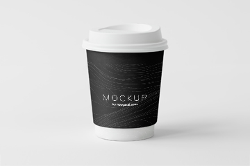
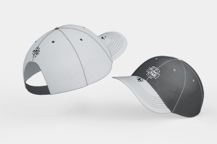

<html lang="en"><head>
<!-- Meta -->
<meta charset="utf-8">
<meta http-equiv="X-UA-Compatible" content="IE=edge">
<meta content="Saad shamsi" name="author">
<meta name="viewport" content="width=device-width, initial-scale=1">
<meta name="description" content="Creating a professional, modern and sophisticated online resume website is easy with Martyn CV / Resume">
<meta name="keywords" content="CV, resume, card, vcard, online cv, online resume, professional resume, portfolio, one page, bootstrap responsive, creative html template, creative design, parallax, personal">

<!-- SITE TITLE -->
<title>Saad CV - Resume / CV / Portfolio</title>
<!-- Favicon Icon -->
<link rel="shortcut icon" type="image/x-icon" href="assets/images/favicon.png">
<!-- Animation CSS -->
<link rel="stylesheet" href="assets/css/animate.css">
<!-- Latest Bootstrap min CSS -->
<link rel="stylesheet" href="assets/bootstrap/css/bootstrap.min.css">
<!-- Google Font -->
<link href="https://fonts.googleapis.com/css?family=Montserrat:100,100i,200,200i,300,300i,400,400i,500,500i,600,600i,700,700i,800,800i,900,900i" rel="stylesheet">
<link href="https://fonts.googleapis.com/css?family=Roboto:100,100i,300,300i,400,400i,500,500i,700,700i,900,900i" rel="stylesheet">
<!-- Icon Font CSS -->
<link rel="stylesheet" href="assets/css/ionicons.min.css">
<link rel="stylesheet" href="assets/css/themify-icons.css">
<!-- FontAwesome CSS -->
<link rel="stylesheet" href="assets/css/all.min.css">
<!-- Flaticon Font CSS -->
<link rel="stylesheet" href="assets/css/flaticon.css">
<!--- owl carousel CSS-->
<link rel="stylesheet" href="assets/owlcarousel/css/owl.carousel.min.css">
<link rel="stylesheet" href="assets/owlcarousel/css/owl.theme.css">
<link rel="stylesheet" href="assets/owlcarousel/css/owl.theme.default.min.css">
<!-- Magnific Popup CSS -->
<link rel="stylesheet" href="assets/css/magnific-popup.css">
<!-- Scrollbar Css -->
<link rel="stylesheet" href="assets/css/jquery.mCustomScrollbar.min.css">
<!-- Style CSS -->
<link rel="stylesheet" href="assets/css/style.css">
<link rel="stylesheet" href="assets/css/responsive.css">

<!--  -->

</head>

<body data-spy="scroll" data-target=".navbar-nav" data-offset="110">
<!--    

 

	<ul class="list_none">
    	<li><a href="https://1.envato.market/L1kKj" style="background-color:#88C74A" title="Buy Now"><i class="ion-android-cart"></i></a></li>
        <li><a href="javascript:void(0);" class="demo_icon" title="More Templates" style="background-color:#FF1D4D"><i class="ion-android-apps"></i></a></li>
    </ul>
    

    	<h5 class="font_style1">More HTML Template</h5>
    	<ul>	
        	<li><a href="https://bestwebcreator.com/dhyana/" title="Dhyana - Yoga Studio &amp; Meditation">Dhyana - Yoga Studio &amp; Meditation</a></li>
        	<li><a href="https://bestwebcreator.com/organiq/" target="_blank" title="Organiq - Organic Food HTML Template">Organiq - Organic Food HTML Template</a></li>
        	<li><a href="https://bestwebcreator.com/cafebiz/demo/" target="_blank" title="Cafe Biz | Restaurant &amp; Food">Cafe Biz | Restaurant &amp; Food</a></li>
        	<li><a href="https://bestwebcreator.com/eduglobal/" target="_blank" title="Eduglobal - LMS Education &amp; Courses">Eduglobal - LMS Education &amp; Courses</a></li>
            <li><a href="https://bestwebcreator.com/anger/" target="_blank" title="Anger - Creative Responsive Multi-Purpose">Anger - Creative Responsive Multi-Purpose</a></li>
            <li><a href="https://bestwebcreator.com/ATZShop/" target="_blank" title="ATZ Shop - Online Shopping Store">ATZ Shop - Online Shopping Store</a></li>
            <li><a href="https://bestwebcreator.com/cryptocash/" target="_blank" title="Cryptocash – ICO Cryptocurrency &amp; ICO Landing Page HTML5 + Dashboard Template">ICO Cryptocurrency Landing Page</a></li>
            <li><a href="https://bestwebcreator.com/cryptoking-landing-page/" target="_blank" title="Cryptoking ICO - Bitcoin &amp; ICO Cryptocurrency Landing Page HTML Template">Bitcoin &amp; ICO Cryptocurrency Landing Page</a></li>
            <li><a href="https://bestwebcreator.com/bitcurrency-demo/" target="_blank" title="Bitcurrency - Bitcoin and Cryptocurrency Landing Page HTML Template">Bitcoin and Cryptocurrency Landing Page</a></li>
        </ul>
    

 -->

<!-- LOADER -->

    

		

          

          

          

		

	

<!-- END LOADER --> 

<!-- START HEADER -->
<header class="header_wrap fixed-top dark_skin hover_menu_style3 transparent-header nav-fixed">
  

    <nav class="navbar navbar-expand-lg"> 
    	<a class="navbar-brand page-scroll" href="#home_section">
        	<!-- 
            
             -->
        </a>
        <button class="navbar-toggler" type="button" data-toggle="collapse" data-target="#navbarSupportedContent" aria-controls="navbarSupportedContent" aria-expanded="false" aria-label="Toggle navigation">  </button>
      	

        	<a class="navbar-brand page-scroll" href="#home_section">
                <!-- 
                
                 -->
            </a>
            <ul class="navbar-nav">
                <li>
                    <a class="nav-link page-scroll" href="#home_section">Home</a>
                </li>
                <li>
                    <a class="nav-link page-scroll" href="#about">About</a>
                </li>
                <!-- <li>
                    <a class="nav-link page-scroll" href="#services">Services</a>
                </li>
                <li>
                    <a class="nav-link page-scroll" href="#portfolio">Portfolio</a>
                </li> -->
                <li>
                    <a class="nav-link page-scroll" href="#experience">Experience</a>
                </li>
                <!-- <li>
                    <a class="nav-link page-scroll active" href="#blog">blog</a>
                </li> -->
                <li>
                    <a class="nav-link page-scroll" href="#contact">contact</a>
                </li>
                <li class="dropdown">
                    <!-- <a class="dropdown-toggle nav-link" href="#" data-toggle="dropdown">Pages</a> -->
                    <!-- 

                        <ul> 
                            <li><a class="dropdown-item nav-link nav_item" href="portfolio-detail-dark.html">portfolio detail dark</a></li>
                            <li><a class="dropdown-item nav-link nav_item" href="portfolio-detail-sidemenu-dark.html">portfolio detail sidemenu dark</a></li>
                            <li><a class="dropdown-item nav-link nav_item" href="portfolio-detail-sidemenu-white.html">portfolio detail sidemenu white</a></li>
                            <li><a class="dropdown-item nav-link nav_item" href="portfolio-detail-white.html">portfolio detail white</a></li>
                            <li><a class="dropdown-item nav-link nav_item" href="blog-detail-dark.html">blog detail dark</a></li>
                            <li><a class="dropdown-item nav-link nav_item" href="blog-detail-sidemenu-dark.html">blog detail sidemenu dark</a></li>
                            <li><a class="dropdown-item nav-link nav_item" href="blog-detail-sidemenu-white.html">blog detail sidemenu white</a></li>
                            <li><a class="dropdown-item nav-link nav_item" href="blog-detail-white.html">blog detail white</a></li>
                        </ul>
                    
 -->
                </li>
            </ul>
        

    </nav>
  

</header>
<!-- START HEADER --> 

<!-- START SECTION BANNER -->
<section id="home_section" class="banner_section banner_shape">
    

        
<!-- STRART CONTAINER -->
            

                

                    

                        <h2 class="animation animated fadeInUp" data-animation="fadeInUp" data-animation-delay="0.02s" style="animation-delay: 0.02s; opacity: 1;">Hello, I'm Saad Shamsi</h2>
                        

                            <b>Full Stack Developer</b> <b>Technical Writer</b>
                        

                        <h4 class="animation animated fadeInUp" data-animation="fadeInUp" data-animation-delay="0.03s" style="animation-delay: 0.03s; opacity: 1;">I'm a Freelance |</h4>
                        
Node JS, Angular, React Native, Dot Net, MySql, MS SQL, MongoDB, Jira, Pivotal Tracker, BaseCamp, Sifter

                        <a href="#" class="btn btn-default rounded-0 btn-aylen animation animated fadeInUp" data-animation="fadeInUp" data-animation-delay="0.05s" style="animation-delay: 0.05s; opacity: 1;">Download CV</a>
                    

                

                

                	

                    	<!--  -->
                    

                

            

        
<!-- END CONTAINER-->
    

    <!-- 

    	<ul class="list_none social_icons text-center">
            <li><a href="#" class="sc_facebook"><i class="ion-social-facebook"></i></a></li>
            <li><a href="#" class="sc_twitter"><i class="ion-social-twitter"></i></a></li>
            <li><a href="#" class="sc_google"><i class="ion-social-googleplus"></i></a></li>
            <li><a href="#" class="sc_youtube"><i class="ion-social-youtube-outline"></i></a></li>
            <li><a href="#" class="sc_instagram"><i class="ion-social-instagram-outline"></i></a></li>
        </ul>
    
 -->
</section>
<!-- END SECTION BANNER --> 

<!-- START SECTION ABOUT US -->
<section id="about">
    

        

                

                	<!-- 

                    	
                    
 -->
                

                

                	

                        
 
                          <h2>About Me</h2>
                        

                        
Qualified professional developer, having Master’s degree and have extensive experience in developing enterprise applications 
                            with hands on experience in development of database driven application either on web based, mobile based and desktop based platform. 
                            I am enthusiastic and highly motivated individual having six plus (6+) years of working experience in professional environment and 
                            with teams as well that are result and profit oriented.

                        <!-- 
All the Lorem Ipsum generators on the Internet tend to repeat predefined chunks as necessary.Iipsum dolor sit amet consectetur adipiscing elitllus blandit massa enim.
 -->
                        

                        
 
                            <h5>Basic Info</h5>
                        

                        <ul class="profile_info list_none" style="
                        display: block;
                    ">
                            <!-- <li>
                                Date of birth:
                                
20 August 1990

                            </li> -->
                            <li>
                                Phone No:
                                
+923333299588

                            </li>
                            <li></li>
                             
                            <li>
                                Email:
                                
<a href="mailto:imsaadshamsi@gmail.com">imsaadshamsi@gmail.com</a>

                            </li>
                            <li></li>
                            <!-- <li>
                                Address:
                                
 123 Street, Old Trafford, London 

                            </li> -->
                            <!-- <li>
                                Website:
                                
 www.mywebsite.com 

                            </li> -->
                            <!-- <li>
                                Freelance:
                                
Available

                            </li> -->
                        </ul>
                    

                

            

    

</section>
<!-- END SECTION ABOUT US -->

<!-- START SECTION SERVICES -->
<section id="services" class="bg_gray" style="display: none;">
	

    	

        	

            	

                	<h2>Awesome Services</h2>
                

                 
Lorem ipsum dolor sit amet, consectetur adipiscing elit. Phasellus blandit massa enim. Nullam id varius nunc id varius nunc.

            

        

        

        	

            	

                    
	
                        <i class="ti-image"></i>
                    

                    

                        <h5>Graphic Design</h5>
                        
There are many variations of passages of Lorem Ipsum available, but the majority have suffered alteration

                    

                

            

            

            	

                    
	
                        <i class="ti-video-camera"></i>
                    

                    

                        <h5>Digital Marketing</h5>
                        
There are many variations of passages of Lorem Ipsum available, but the majority have suffered alteration

                    

                

            

            

            	

                    
	
                        <i class="ti-crown"></i>
                    

                    

                        <h5>Branding</h5>
                        
There are many variations of passages of Lorem Ipsum available, but the majority have suffered alteration

                    

                 

            

        	

            	

                    
	
                        <i class="ti-light-bulb"></i>
                    

                    

                        <h5>Development</h5>
                        
There are many variations of passages of Lorem Ipsum available, but the majority have suffered alteration

                    

                

            

            

            	

                    
	
                        <i class="ti-mobile"></i>
                    

                    

                        <h5>Mobile Application</h5>
                        
There are many variations of passages of Lorem Ipsum available, but the majority have suffered alteration

                    

                

            

            

            	

                    
	
						<i class="ti-camera"></i>
                    

                    

                        <h5>Photography</h5>
                        
There are many variations of passages of Lorem Ipsum available, but the majority have suffered alteration

                    

                

            

        

    

</section>
<!-- END SECTION SERVICES -->

<!-- START SECTION PORTFOLIO -->
<section id="portfolio" class="pb_70" style="display: none;">
    

    	

            

                

                    <h2>My Portfolio</h2>
                

                
Lorem ipsum dolor sit amet, consectetur adipiscing elit. Phasellus blandit massa enim. Nullam id varius nunc id varius nunc.

            

        

        

            

                

            

        

        

            

                <ul class="list_none grid_filter filter_tab2 animation animated fadeInUp" data-animation="fadeInUp" data-animation-delay="0.04s" style="animation-delay: 0.04s; opacity: 1;">
                    <li><a href="#" class="current" data-filter="*">all</a></li>
                    <li><a href="#" data-filter=".brands">Branding</a></li>
                    <li><a href="#" data-filter=".web-design">Web Design</a></li>
                    <li><a href="#" data-filter=".development">Development</a></li>
                </ul>
            

        

        

            

                <ul class="grid_container gutter_medium work_col3 portfolio_gallery portfolio_style2 animation animated fadeInUp" data-animation="fadeInUp" data-animation-delay="0.04s" style="animation-delay: 0.04s; opacity: 1; position: relative; height: 526.625px;">
                	<li class="grid-sizer"></li>
                    <!-- START PORTFOLIO ITEM -->
                    <li class="grid_item web-design" style="position: absolute; left: 0%; top: 0px;">
                        

                            
                                

                                    

                                        <a href="assets/images/portfolio_item1.jpg" class="image_popup"><i class="ion-image"></i></a>
                                        <a href="portfolio-detail-white.html"><i class="ion-plus"></i></a>
                                    

                                    <h5><a href="portfolio-detail-white.html">Branded Products</a></h5>
                                    
Web Design

                              

                        

                    </li>
                    <!-- END PORTFOLIO ITEM -->
                    <!-- START PORTFOLIO ITEM -->
                    <li class="grid_item brands web-design development" style="position: absolute; left: 33.3292%; top: 0px;">
                        

                            
                                

                                    

                                        <a href="assets/images/portfolio_item2.jpg" class="image_popup"><i class="ion-image"></i></a>
                                        <a href="portfolio-detail-white.html"><i class="ion-plus"></i></a>
                                    

                                    <h5><a href="portfolio-detail-white.html">Visiting Card</a></h5>
                                    
Branding, Web Design, Development

                              

                        

                    </li>
                    <!-- END PORTFOLIO ITEM -->
                    <!-- START PORTFOLIO ITEM -->
                    <li class="grid_item brands web-design" style="position: absolute; left: 66.6584%; top: 0px;">
                        

                        	

                                
                                
                         	

<a href="#" class="image_link">
                                    
                                </a>

<a href="#" class="image_link">
                                    
                                </a>

<i class="ion-ios-arrow-back"></i>

<i class="ion-ios-arrow-forward"></i>

                                

                                    

                                        <a href="assets/images/portfolio_item3.jpg" class="image_popup"><i class="ion-images"></i></a>
                                        
                                        <a href="portfolio-detail-white.html"><i class="ion-plus"></i></a>
                                    

                                    <h5><a href="portfolio-detail-white.html">Coffee Cup Mockup</a></h5>
                                    
Branding, Web Design

                              

                        

                    </li>
                    <!-- END PORTFOLIO ITEM -->
                    <!-- START PORTFOLIO ITEM -->
                    <li class="grid_item brands development" style="position: absolute; left: 0%; top: 263.328px;">
                        

                            
                                

                                    

                                        <a href="assets/images/portfolio_item5.jpg" class="image_popup"><i class="ion-image"></i></a>
                                        <a href="portfolio-detail-white.html"><i class="ion-plus"></i></a>
                                    

                                    <h5><a href="portfolio-detail-white.html">Letter Design</a></h5>
                                    
Branding, Development

                              

                        

                    </li>
                    <!-- END PORTFOLIO ITEM -->
                    <!-- START PORTFOLIO ITEM -->
                    <li class="grid_item brands web-design development" style="position: absolute; left: 33.3292%; top: 263.328px;">
                        

                            
                                

                                    

                                        <a href="assets/images/portfolio_item6.jpg" class="image_popup"><i class="ion-image"></i></a>
                                        <a href="portfolio-detail-white.html"><i class="ion-plus"></i></a>
                                    

                                    <h5><a href="portfolio-detail-white.html">Branding Cap</a></h5>
                                    
Branding, Web Design, Development

                              

                        

                    </li>
                    <!-- END PORTFOLIO ITEM -->
                    <!-- START PORTFOLIO ITEM -->
                    <li class="grid_item brands web-design development" style="position: absolute; left: 66.6584%; top: 263.328px;">
                        

                            
                                

                                    

                                        <a href="assets/images/portfolio_item7.jpg" class="image_popup"><i class="ion-image"></i></a>
                                        <a href="portfolio-detail-white.html"><i class="ion-plus"></i></a>
                                    

                                    <h5><a href="portfolio-detail-white.html">Branding Cream</a></h5>
                                    
Branding, Web Design, Development

                              

                        

                    </li>
                    <!-- END PORTFOLIO ITEM -->
                </ul>
            

        

    

</section>
<!-- END SECTION PORTFOLIO -->

<!-- START SECTION COUNTER --> 
<section class="counter_wrap bg_gray" style="display: none;">
    

        

            

                

                    <i class="flaticon-briefing"></i>
                    <h3 class="counter_text">800+</h3>
                    
Projects Completed

                

            

            

                

                    <i class="flaticon-laugh"></i>
                    <h3 class="counter_text">524</h3>
                    
Happy Clients

                

            

            

                

                    <i class="flaticon-coffee-cup"></i>
                    <h3 class="counter_text">654</h3>
                    
Cup Of Tea

                

            

            

                

                    <i class="flaticon-trophy"></i>
                    <h3 class="counter_text">225</h3>
                    
Awards Won

                

            

        

    

</section>
<!-- END SECTION COUNTER -->

<!-- START WORK EXPERIENCES -->
<section id="experience">
	

    	

        	

            	

                	<h2>Work Experiences</h2>
                

                <!-- 
Lorem ipsum dolor sit amet, consectetur adipiscing elit. Phasellus blandit massa enim. Nullam id varius nunc id varius nunc.
 -->
            

        

        

            

                

                    

                        <h4>Jr. Software Engineer</h4>
                        
2014-2015 Paradigm Solution

                        

                        
Web based solutions developed on Webform Microsoft technology.

                    

                

            

            

                

                    

                        <h4>Software Engineer</h4>
                        
2015-2017 Creative Chaos

                        

                        
Event Management, Ticketing applications developed on Dot Net MVC, Angular, Dynamic Website on Kentico

                    

                

            

            

                

                    

                        <h4>Senior/Lead Developer</h4>
                        
2018-Present 

                        

                        
Student Portal, E-Learning portal MEAN stack platform

                    

                

            

        

        
    

</section>
<!-- END WORK EXPERIENCES -->

<!-- START SECTION TESTIMONIAL -->
<section class="bg_gray" style="display: none;">	
	

    	

        	

            	
	
                	<h2>Clients Testimonials</h2>
                

                
Lorem ipsum dolor sit amet, consectetur adipiscing elit. Phasellus blandit massa enim. Nullam id varius nunc id varius nunc.

                

            

        

        

        	

            	

                	
                    
                    
                    
                

                    	

                        	

                                

                                    
                                

                                

                                    <h6>Alden Smith</h6>
                                    Creative Designer
                                

                            

                            

                                
Sed ut perspiciatis unde omnis iste natus error sit voluptatem accusantium doloremque laudantium, quaeillo inventore veritatis et quasi architecto explicabo.

                            

                        

                    

                    	

                        	

                                

                                    
                                

                                

                                    <h6>Daisy Lana</h6>
                                    Creative Director
                                

                            

                            

                            	
Sed ut perspiciatis unde omnis iste natus error sit voluptatem accusantium doloremque laudantium, quaeillo inventore veritatis et quasi architecto explicabo.

                            

                        

                    

                    	

                        	

                                

                                    
                                

                                

                                    <h6>Helena Amos</h6>
                                    Creative Designer
                                

                            

                            

                            	
Sed ut perspiciatis unde omnis iste natus error sit voluptatem accusantium doloremque laudantium, quaeillo inventore veritatis et quasi architecto explicabo.

                            

                        

                    

                    	

                        	

                                

                                    
                                

                                

                                    <h6>Lissa Castro</h6>
                                    Developer
                                

                            

                            

                            	
Sed ut perspiciatis unde omnis iste natus error sit voluptatem accusantium doloremque laudantium, quaeillo inventore veritatis et quasi architecto explicabo.

                            

                        

                    

                    	

                        	

                                

                                    
                                

                                

                                    <h6>Alden Smith</h6>
                                    Creative Designer
                                

                            

                            

                                
Sed ut perspiciatis unde omnis iste natus error sit voluptatem accusantium doloremque laudantium, quaeillo inventore veritatis et quasi architecto explicabo.

                            

                        

                    

                    	

                        	

                                

                                    
                                

                                

                                    <h6>Daisy Lana</h6>
                                    Creative Director
                                

                            

                            

                            	
Sed ut perspiciatis unde omnis iste natus error sit voluptatem accusantium doloremque laudantium, quaeillo inventore veritatis et quasi architecto explicabo.

                            

                        

                    

                    	

                        	

                                

                                    
                                

                                

                                    <h6>Helena Amos</h6>
                                    Creative Designer
                                

                            

                            

                            	
Sed ut perspiciatis unde omnis iste natus error sit voluptatem accusantium doloremque laudantium, quaeillo inventore veritatis et quasi architecto explicabo.

                            

                        

                    

                    	

                        	

                                

                                    
                                

                                

                                    <h6>Lissa Castro</h6>
                                    Developer
                                

                            

                            

                            	
Sed ut perspiciatis unde omnis iste natus error sit voluptatem accusantium doloremque laudantium, quaeillo inventore veritatis et quasi architecto explicabo.

                            

                        

                    

                    	

                        	

                                

                                    
                                

                                

                                    <h6>Alden Smith</h6>
                                    Creative Designer
                                

                            

                            

                                
Sed ut perspiciatis unde omnis iste natus error sit voluptatem accusantium doloremque laudantium, quaeillo inventore veritatis et quasi architecto explicabo.

                            

                        

                    

                    	

                        	

                                

                                    
                                

                                

                                    <h6>Daisy Lana</h6>
                                    Creative Director
                                

                            

                            

                            	
Sed ut perspiciatis unde omnis iste natus error sit voluptatem accusantium doloremque laudantium, quaeillo inventore veritatis et quasi architecto explicabo.

                            

                        

                    

<i class="ion-ios-arrow-back"></i>

<i class="ion-ios-arrow-forward"></i>

            

        

    

</section>
<!-- END SECTION TESTIMONIAL -->

<!-- START SECTION BLOG -->
<section id="blog" class="pb_20" style="display: none;">
	

    	

        	

            	

                	<h2>My Letest Blog</h2>
                

                
Lorem ipsum dolor sit amet, consectetur adipiscing elit. Phasellus blandit massa enim. Nullam id varius nunc id varius nunc.

            

        

        

        	

            	

            

        

        

        	

            	

                	

                        
                    

                    

                    	

                        	
<a href="#">UI/UX Design</a>

                            <h5 class="blog_title"><a href="blog-detail-white.html">Look Up At The Innovative Ways Team Work </a></h5>
                            <ul class="list_none blog_meta">
                                <li><a href="#"><i class="ion-calendar"></i>April 14, 2018</a></li>
                                <li><a href="#"><i class="ion-chatboxes"></i>2 Comment</a></li>
                        	</ul>
                            
If you are going to use a passage of Lorem Ipsum, you need to be sure there isn't anything embarrassing hidden in the middle of text

                            <a href="blog-detail-white.html" class="read_more">Read More</a>
                        

                    

                

            

            

            	

                	

                        
                    

                    

                    	

                        	
<a href="#">Branding</a>

                            <h5 class="blog_title"><a href="blog-detail-white.html">How To Create A Website For Your Business?</a></h5>
                            <ul class="list_none blog_meta">
                                <li><a href="#"><i class="ion-calendar"></i>April 14, 2018</a></li>
                                <li><a href="#"><i class="ion-chatboxes"></i>2 Comment</a></li>
                        	</ul>
                            
Ipsum generators on the Internet tend to repeat predefined chunks as necessary, making this the first true generator on the Internet.

                            <a href="blog-detail-white.html" class="read_more">Read More</a>
                        

                    

                

            

            

            	

                	

                        
                    

                    

                    	

                        	
<a href="#">Developing</a>

                            <h5 class="blog_title"><a href="blog-detail-white.html">How To Perfect You Get Free expensive Directories</a></h5>
                            <ul class="list_none blog_meta">
                                <li><a href="#"><i class="ion-calendar"></i>April 14, 2018</a></li>
                                <li><a href="#"><i class="ion-chatboxes"></i>2 Comment</a></li>
                        	</ul>
                            
It uses a dictionary of over combined with a handful of model sentence structures, to generate Lorem Ipsum which looks reasonable

                            <a href="blog-detail-white.html" class="read_more">Read More</a>
                        

                    

                

            

        

    

</section>
<!-- END SECTION BLOG -->

<!-- START SECTION CONTACT -->
<section id="contact" class="small_pt">
	

    	

        	

            	

                	<h2>Contact Me</h2>
                

            

        

    	

        	

            	

                    <form method="post" name="enq">
                    

                        

                            <input required="required" placeholder="Enter Name *" id="first-name" class="form-control" name="name" type="text">
                         

                        

                            <input required="required" placeholder="Enter Email *" id="email" class="form-control" name="email" type="email">
                        

                        

                            <input placeholder="Enter Subject" id="subject" class="form-control" name="subject" type="text">
                        

                        

                            <textarea required="required" placeholder="Message *" id="description" class="form-control" name="message" rows="5"></textarea>
                        

                        

                            <button type="submit" title="Submit Your Message!" class="btn btn-default rounded-0 btn-aylen" id="submitButton" name="submit" value="Submit">Submit</button>
                        

                        

                            

                        

                    

                </form>		
                

            

            

            	

                    <iframe src="https://www.google.com/maps/embed?pb=!1m18!1m12!1m3!1d193229.77301255226!2d-74.05531241936525!3d40.823236500441624!2m3!1f0!2f0!3f0!3m2!1i1024!2i768!4f13.1!3m3!1m2!1s0x89c2f613438663b5%3A0xce20073c8862af08!2sW+123rd+St%2C+New+York%2C+NY%2C+USA!5e0!3m2!1sen!2sin!4v1533565007513" allowfullscreen=""></iframe>
                

            

        

    

</section>
<!-- START SECTION CONTACT -->

<!-- START FOOTER SECTION --> 
<footer class="bg_gray" style="display: none;">
	

        

            

                

                	

                    	
                    

                    <h6 class="widget_title pt-3">Subscribe Our Newsletter</h6>
                    

                        <form>
                        	
 
                            <input type="text" required="" placeholder="Enter Email Address">
                            

                            <button type="submit" title="Subscribe" class="btn btn-default rounded-0 btn-aylen" name="submit" value="Submit">
                            	subscribe
                            </button>
                        </form>
                    

                    <ul class="list_none social_icons pt-4">
                    	<li><a href="#" class="sc_facebook"><i class="ion-social-facebook"></i></a></li>
                        <li><a href="#" class="sc_twitter"><i class="ion-social-twitter"></i></a></li>
                        <li><a href="#" class="sc_google"><i class="ion-social-googleplus"></i></a></li>
                        <li><a href="#" class="sc_youtube"><i class="ion-social-youtube-outline"></i></a></li>
                        <li><a href="#" class="sc_instagram"><i class="ion-social-instagram-outline"></i></a></li>
                    </ul>
                

            

        

    

    

        

            

                

                    

                        

                            
© 2019 All Rights Reserved By <a href="#" class="text_default">Bestwebcreator</a>

                        

                    

                

            

        

    

</footer>
<!-- END FOOTER SECTION --> 

<a href="#" class="scrollup" style=""><i class="ion-ios-arrow-up"></i></a> 

<!-- Latest jQuery --> 
 
<!-- jquery-ui --> 

<!-- popper min js --> 

<!-- Latest compiled and minified Bootstrap --> 
 
<!-- owl-carousel min js  --> 
 
<!-- magnific-popup min js  --> 
 
<!-- waypoints min js  --> 
 
<!-- parallax js  --> 
 
<!-- countdown js  --> 
 
<!-- jquery.counterup.min js --> 

<!-- imagesloaded js -->

<!-- isotope min js --> 

<!-- vanilla-tilt.babel.min js -->
 
<!-- typed.min js --> 

<!-- typed text js --> 

<!-- mCustomScrollbar.concat.min js -->

<!-- scripts js --> 

</body></html>
